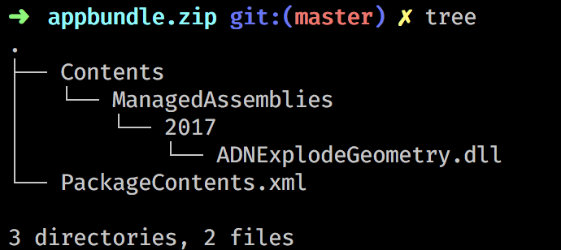
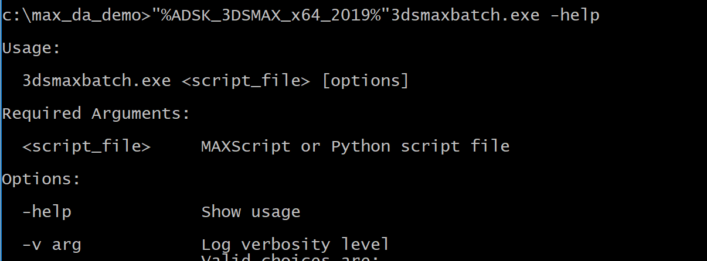
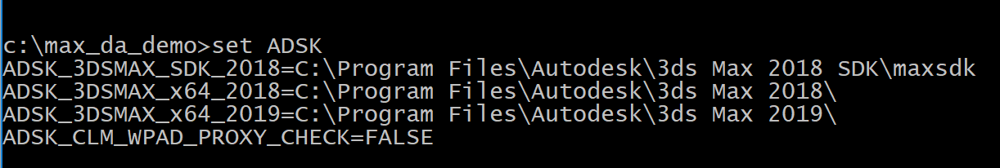
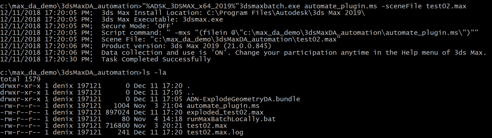
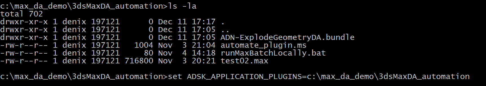
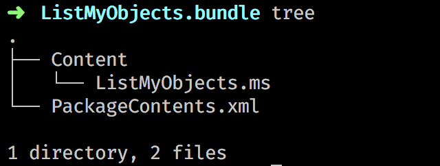
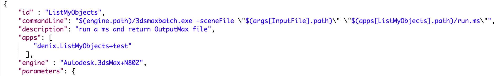

# learn.forge.designautomation - 3ds Max


To use Design Automation in general, the following steps are needed:

1. Create the appbundle;
2. Create the activity;
3. Create the work item;
4. Send the job and download the results;


## 1. Creating the appbundle
In Design Automation, the app bundle is the container that could hold custom code, plugin, scripts and any other content that is needed during every workitem execution.

The appbundle is a zip archived folder and should finish with `.bundle`. 

> Example: myFiles.bundle
	
Inside this folder, the first thing that should be present is ` PackageContents.xml`, which describes to the used engine (g.e. 3ds Max) what to load on startup. For more documentation on this xml file check [here](https://help.autodesk.com/view/3DSMAX/2019/ENU/?guid=__developer_writing_plug_ins_packaging_plugins_packagexml_format_html).

> Example: A very simple containing a 3ds Max plugin written using 3ds Max .Net SDK, could be placed inside the bundle like this:
	
>

> and the minimal amount of specification needed inside ` PackageContents.xml` could be the following:

>	```xml
>	
>	<?xml version="1.0" encoding="utf-8"?>
>	<ApplicationPackage 
>		AutodeskProduct="3ds Max" 
>		ProductType="Application"
>		ProductCode="3ds Max Explode geometry plug-in.">
>	
>		<CompanyDetails />	
>		
>		<Components Description="pre-start-up plugin part">
>			<RuntimeRequirements 
>						OS="Win64" 
>						Platform="3ds Max" 
>						SeriesMin="2017" 
>						SeriesMax="2019" />
>			<ComponentEntry 
>					AppName="ADNExplodeGeometry" 
>					Version="2.1.0" 
>					ModuleName="./Contents/ManagedAssemblies/2017/ADNExplodeGeometry.dll" />
>		</Components>
>	  
>	```


**Note:** The above xml is just the minimum necessary, the schema for the ` PackageContents.xml` can accept a lot of information. For the full list, check [here](https://help.autodesk.com/view/3DSMAX/2019/ENU/?guid=__developer_writing_plug_ins_packaging_plugins_packagexml_format_html).

### Testing the appbundle locally

Before using the appbundle in Design Automation workflow, it is a good practice to test it locally. For this purpose, you can use `3dsmaxbatch.exe` located in the root of the 3ds Max installation folder:



**Tip:** Note the use of environment variable to specify the 3ds installation folder. To get these environment variables, just type in Command Line `set ADSK`:




The workflow of using the `3dsmaxbatch.exe` is based on passing to it an execution script and the scene file to work with.
If needed, there is also the option of passing arguments for values (numbers) and strings.To understand the use of `3dsmaxbatch.exe`, please consult [Using 3ds Max Batch](https://knowledge.autodesk.com/support/3ds-max/learn-explore/caas/CloudHelp/cloudhelp/2019/ENU/3DSMax-Batch/files/GUID-48A78515-C24B-4E46-AC5F-884FBCF40D59-htm.html).

The simplest use of `3dsmaxbatch.exe` is passing a script (let us call it work script) and the scene file `3dsmaxbatch.exe myScript.ms -sceneFile myMaxFile.max`:



The complexity of the script file can vary and either contain the MAXScript code to do some operation on the file, or invoke plugin operations.

In case the work script is invoking plugin operations, we must make sure that before the 3ds max is running, the needed plugin was located and loaded.

3ds Max has special location for plugins, but in our case we are more interested in ways of informing 3ds Max of our custom location of the self contained plugin.

The bundle format is assuring that the plugin is self-contained and will be picked up by the 3ds Max and properly installed. The location of the bundle can be specified to 3ds Max by setting the `ADSK_APPLICATION_PLUGINS` environment variable:




> Example: Suppose that you create a MAXScript script (or C++, .Net plugin) that exposes just a simple function of listing the objects and saving the results into `list.txt` file:
> 
> ```sql
> fn ListMyObject = 
(
	dir = sysInfo.currentdir + "/list.txt"
	f = (createFile dir)
	allObjects = $*
	for OBJ in allObjects do(
		val1 = OBJ as string
		val1 += "\n"
		format val1 to:f
	)
)
```
> we can create a folder with the following structure
> 
> 
> 
> where the `PackageContents.xml` will have following content:
> 
> ```xml
> <?xml version="1.0" encoding="utf-8"?>
<ApplicationPackage 
					SchemaVersion="1.0"
					AutodeskProduct="3ds Max"
					ProductType="Application"
					ProductCode="3ds Max Design Share Plugin">
<CompanyDetails />
	<Components Description="pre-start-up scripts parts">
		<RuntimeRequirements 
				OS="Win64" 
				Platform="3ds Max" 
				SeriesMin="2018" 
				SeriesMax="2019" />
		<ComponentEntry 
				AppName="ListMyObjects" 
				Version="1.0.0"  
				ModuleName="./Content/ListMyObjects.ms" />
	</Components>
</ApplicationPackage>
> ```
> zip it and if our current bundle is located at `C:\my_bundle`, then before invoking the `3dsmaxbatch.exe`, we should write in Command Prompt
> 
> ```bash
> set ADSK_APPLICATION_PLUGINS=c:\my_bundle
> ```
> This will make sure that before `3dsmaxbatch.exe` loads the scene and executes the work script, it will look into this folder and load the bundle located there.
> 
> Next, we could write a simple working script (let us call it `run.ms`) that just invokes that function:
> 
> ```sql
> ListMyObject()
> ```
> 
> all what is left is just make sure that we are in the same folder as the running script and the scene (or specify the absolute/relative path) and run `3dsmaxbatch.exe run.ms -sceneFile myMaxFile.max`.
> After the task is complete, you should have a `list.txt` in your folder, listing all the objects from the scene.

This covered the simple use-case with no passed params. In case we need to pass some configuration params, the documentation on [3dsmaxbatch.exe](https://help.autodesk.com/view/3DSMAX/2019/ENU/?guid=GUID-48A78515-C24B-4E46-AC5F-884FBCF40D59) provides more details on this, but the essential are the following arguments:


```bash

 -mxsString arg    MAXScript String Parameter option, where arg=<key>:<value>
                    <value> will be accessible as a MAXScript string in
                    <script_file> through the maxOps.mxsCmdLineArgs dictionary
                    using <key> as the dictionary key.
                    Can be specified multiple times.

  -mxsValue arg     MAXScript Value Parameter option, where arg=<key>:<value>
                    <value> will be accessible as a MAXScript value in
                    <script_file> through the maxOps.mxsCmdLineArgs dictionary
```

As the documentation mentions, the arguments will be available to the work script through `maxOps.mxsCmdLineArgs` dictionary:

> Example: Consider the following Command Prompt invocation:
> 
> ```bash
> >3dsmaxbatch demo_mxscmdline.ms -mxsString string1:"Hello"  -mxsValue value1:"[3,12,22]" -mxsValue value2:"Point3 3 8 2.3" -listenerLog "test.log"
> ```
> 
> and the work script:
> 
> ```sql
> opts = maxOps.mxsCmdLineArgs
for k in opts.keys do (
	format "% == % class: %\n" k opts[k] (classOf opts[k])
)
```
> 
> the `test.log` file (we specified this file as the last argument) will contain:
> 
> ```sql
> #string1 == Hello class: String
#value2 == [3,8,2.3] class: Point3
#value1 == [3,12,22] class: Point3

>```

All this is an important step in understanding the Design Automation workflow because when creating an activity, you have to specify the `commandLine` param, which will look like:



and by now, this line should look familiar to you.
