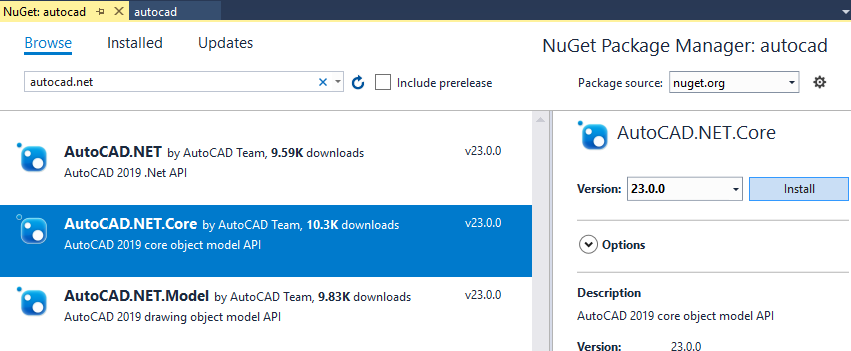

# learn.forge.designautomation - AutoCAD


[](http://developer.autodesk.com/)


# Description

AutoCAD plugin that updates the `width` and `height` of a Dynamic Block.

# Setup

## Prerequisites

1. **Visual Studio** 2017
2. **AutoCAD** 2019 required to compile changes into the plugin
3. **7z zip** requires to create the bundle ZIP, [download here](https://www.7-zip.org/)

## References

This AutoCAD plugin requires **AcCoreMgd** and **AcDbMgd** references, which should restore from NuGet. If not, right-click on **References**, then **Manage NuGet Packages**, search for _AutoCAD.NET_ and add `AutoCAD.NET Core`.

 

## Build

Under **Properties**, at **Build Event** page, the following `Post-build event command line` will copy the DLL into the `\UpdateDWGParam.bundle/Content\` folder, create a `.ZIP` (using [7z](https://www.7-zip.org/)) and copy to the Webapp folder.

```
xcopy /Y /F $(TargetDir)*.dll $(ProjectDir)UpdateDWGParam.bundle\Contents\
del /F $(ProjectDir)..\forgesample\wwwroot\bundles\UpdateDWGParam.zip
"C:\Program Files\7-Zip\7z.exe" a -tzip $(ProjectDir)../forgesample/wwwroot/bundles/UpdateDWGParam.zip  $(ProjectDir)UpdateDWGParam.bundle\ -xr0!*.pdb
```

## Debug Locally

Please review this section of the [My First Plugin Tutorial](https://knowledge.autodesk.com/support/autocad/learn-explore/caas/simplecontent/content/lesson-4-debugging-your-code-for-my-first-autocad-plug.html). The plugin should load and work on AutoCAD 2019 desktop. 

To better emulate the Design Automation approach, it's better to debug with AutoCAD Console. [This blog post describes how to use it](https://adndevblog.typepad.com/autocad/2012/04/getting-started-with-accoreconsole.html).

# Further Reading

- [My First AutoCAD Plugin](https://knowledge.autodesk.com/support/autocad/learn-explore/caas/simplecontent/content/my-first-autocad-plug-overview.html)
- [AutoCAD Developer Center](https://www.autodesk.com/developer-network/platform-technologies/autocad)

## License

This sample is licensed under the terms of the [MIT License](http://opensource.org/licenses/MIT). Please see the [LICENSE](LICENSE) file for full details.

## Written by

Madhukar Moogala [@galakar](https://twitter.com/galakar), [Forge Partner Development](http://forge.autodesk.com)