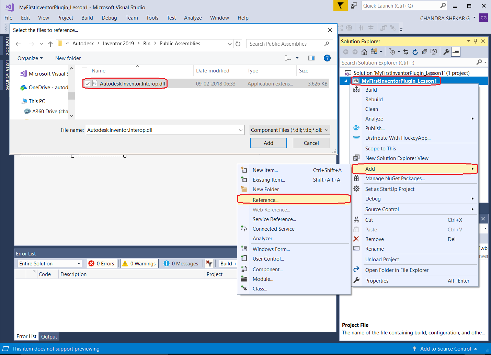

# learn.forge.designautomation - Inventor


[](http://developer.autodesk.com/)


# Description

Inventor plugin that updates the `width` and `height` param of a Part.

# Setup

## Prerequisites

1. **Visual Studio** 2017
2. **Inventor** 2019 required to compile changes into the plugin
3. **7z zip** requires to create the bundle ZIP, [download here](https://www.7-zip.org/)

## References

This Inventor plugin requires **Autodesk.Inventor.Interop** reference, which should resolve from the system GAC. If not, right-click on **References**, then **Add** > **References**, then add it from the follwing folder: `C:\Program Files\Autodesk\Inventor 2019\Bin\Public Assemblies`.

 

## Build

Under **Properties**, at **Build Event** page, the following `Post-build event command line` will copy the DLL into the `\UpdateIPTParam.bundle/Content\` folder, create a `.ZIP` (using [7z](https://www.7-zip.org/)) and copy to the Webapp folder.

```
xcopy /Y /F $(TargetDir)*.dll $(ProjectDir)UpdateIPTParam.bundle\Contents\
del /F $(ProjectDir)..\forgesample\wwwroot\bundles\UpdateIPTParam.zip
"C:\Program Files\7-Zip\7z.exe" a -tzip $(ProjectDir)../forgesample/wwwroot/bundles/UpdateIPTParam.zip  $(ProjectDir)UpdateIPTParam.bundle\ -xr0!*.pdb
```

## Debug Locally

Please review this section of the [My First Plugin Tutorial](https://knowledge.autodesk.com/support/inventor-products/learn-explore/caas/simplecontent/content/lesson-2-programming-overview-autodesk-inventor.html).

# Further Reading

- [My First Inventor Plugin](https://knowledge.autodesk.com/support/inventor-products/learn-explore/caas/simplecontent/content/my-first-inventor-plug-overview.html)
- [Inventor Developer Center](https://www.autodesk.com/developer-network/platform-technologies/inventor)

## License

This sample is licensed under the terms of the [MIT License](http://opensource.org/licenses/MIT). Please see the [LICENSE](LICENSE) file for full details.

## Written by

Chandra Shekar, [Forge Partner Development](http://forge.autodesk.com)