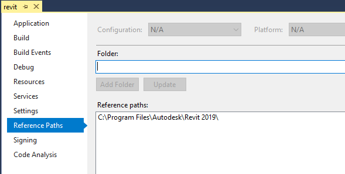

# learn.forge.designautomation - Revit


[](http://developer.autodesk.com/)


# Description

Revit plugin that updates the `width` and `height` of a Windows Family Instance.

# Setup

## Prerequisites

1. **Visual Studio** 2017
2. **Revit** 2019 required to compile changes into the plugin
3. **7z zip** requires to create the bundle ZIP, [download here](https://www.7-zip.org/)

## References

This Revit plugin requires **RevitAPI** and **DesignAutomationBridge** references. The `Reference Paht` option should point to the folder.



## Build

Under **Properties**, at **Build Event** page, the following `Post-build event command line` will copy the DLL into the `\UpdateRVTParam.bundle/Content\` folder, create a `.ZIP` (using [7z](https://www.7-zip.org/)) and copy to the Webapp folder.

```
xcopy /Y /F $(TargetDir)*.dll $(ProjectDir)UpdateRVTParam.bundle\Contents\
del /F $(ProjectDir)..\forgesample\wwwroot\bundles\UpdateRVTParam.zip
"C:\Program Files\7-Zip\7z.exe" a -tzip $(ProjectDir)../forgesample/wwwroot/bundles/UpdateRVTParam.zip  $(ProjectDir)UpdateRVTParam.bundle\ -xr0!*.pdb
```

# Further Reading

- [My First Revit Plugin](https://knowledge.autodesk.com/support/revit-products/learn-explore/caas/simplecontent/content/my-first-revit-plug-overview.html)
- [Revit Developer Center](https://www.autodesk.com/developer-network/platform-technologies/revit)

## License

This sample is licensed under the terms of the [MIT License](http://opensource.org/licenses/MIT). Please see the [LICENSE](LICENSE) file for full details.

## Written by

Naveen Kumar, [Forge Partner Development](http://forge.autodesk.com)