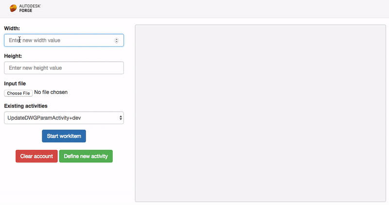

# learn.forge.designautomation - ASP.NET 

# data.management-csharp-webhook


[](http://opensource.org/licenses/MIT)

[](http://developer.autodesk.com/)
[](http://developer.autodesk.com/)
[](http://developer.autodesk.com/)


# Description

Webapp interface that uses Design Automation to update the `width` and `height` param of DWG Dynamic Block (using AutoCAD), RVT Window Family instance (using Revit), IPT Part parameters (using Inventor) and 3DS ... (using 3dsMax). Also includes a `Clear Account` and `Define new Activity` features. Uses ASP.NET Core SignalR to update the interface.

See other projects for bundles.

## Thumbnail



## Demonstration

ToDo

# Setup

## Prerequisites

1. **Forge Account**: Learn how to create a Forge Account, activate subscription and create an app at [this tutorial](http://learnforge.autodesk.io/#/account/). 
2. **Visual Studio**: Either Community (Windows) or Code (Windows, MacOS).
3. **.NET Core** basic knowledge with C#
4. **ngrok**: Routing tool, [download here](https://ngrok.com/)

## Running locally

Clone this project or download it. It's recommended to install [GitHub desktop](https://desktop.github.com/). To clone it via command line, use the following (**Terminal** on MacOSX/Linux, **Git Shell** on Windows):

    git clone https://github.com/autodesk-forge/learn.forge.designautomation
    
Run `ngrok http 3000` to create a tunnel to your local machine, then copy the address into the `FORGE_WEBHOOK_CALLBACK_HOST` environment variable.

**Visual Studio** (Windows):

Right-click on the project, then go to **Debug**. Adjust the settings as shown below. 

 

**Visual Sutdio Code** (Windows, MacOS):

Open the `webapp` folder (only), at the bottom-right, select **Yes** and **Restore**. This restores the packages (e.g. Autodesk.Forge) and creates the launch.json file. See *Tips & Tricks* for .NET Core on MacOS.


At the `.vscode\launch.json`, find the env vars and add your Forge Client ID, Secret and callback URL. Also define the `ASPNETCORE_URLS` variable. The end result should be as shown below:

```json
"env": {
    "ASPNETCORE_ENVIRONMENT": "Development",
    "ASPNETCORE_URLS" : "http://localhost:3000",
    "FORGE_CLIENT_ID": "your id here",
    "FORGE_CLIENT_SECRET": "your secret here",
    "FORGE_WEBHOOK_CALLBACK_HOST": "http://1234.ngrok.io",
},
```

Open `http://localhost:3000` to start the app.

## Deployment

To deploy this application to Heroku, the **Callback URL** for Forge must use your `.herokuapp.com` address. After clicking on the button below, at the Heroku Create New App page, set your Client ID, Secret and Callback URL for Forge.

[](https://heroku.com/deploy)


# Further Reading

Documentation:

- 

Other APIs:

- 

### Known Issues

- 

### Tips & Tricks

This sample uses .NET Core and works fine on both Windows and MacOS, see [this tutorial for MacOS](https://github.com/augustogoncalves/dotnetcoreheroku).

### Troubleshooting

1. **ngrok return 400 (bad request)**: use `ngrok.exe http 3000 -host-header="localhost:3000"` instead.

2. **error setting certificate verify locations** error: may happen on Windows, use the following: `git config --global http.sslverify "false"`

## License

This sample is licensed under the terms of the [MIT License](http://opensource.org/licenses/MIT). Please see the [LICENSE](LICENSE) file for full details.

## Written by

Augusto Goncalves [@augustomaia](https://twitter.com/augustomaia), [Forge Partner Development](http://forge.autodesk.com)